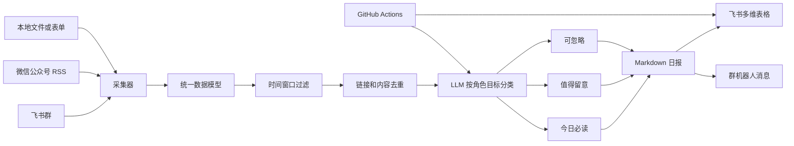

# Info Agent: 从想法到云端落地的通用信息采集手册

Info Agent 是一个可复用的信息采集、筛选、总结和自动投递项目。

它解决的问题不是“每天看更多信息”，而是把一组持续产生内容的来源变成一份稳定、可追踪、符合个人决策目标的系统。

当前仓库是一套完整参考实现，主题是 AI 行业情报，目标用户是 AI 产品经理、入门级 AI 解决方案顾问和 AI 应用开发求职者。你可以保留运行框架，替换信息源、筛选规则、输出格式、目标用户和投递位置，把它改造成其他类型的信息 Agent。

## 1. 核心链路

这套项目可以抽象成五步：

```text
信息源 -> 采集与标准化 -> 去重 -> 按目标筛选和总结 -> 自动投递
```

完整流程：



## 2. 为什么不是普通资讯订阅

普通订阅按来源和发布时间推送，信息 Agent 应具备以下能力：

| 能力 | 说明 |
| --- | --- |
| 目标感知 | 根据用户角色和决策目标判断什么值得看 |
| 多源聚合 | 同时处理群消息、RSS、文件、API 和人工输入 |
| 时间窗口 | 只处理最近一段时间的新内容 |
| 去重 | 按链接或标题合并同一事件 |
| 分类 | 使用明确规则区分必读、留意和忽略 |
| 摘要 | 生成固定格式、可直接消费的内容 |
| 结构化输出 | 每一项可写入多维表格或数据库 |
| 自动运行 | 在云端按计划执行，不依赖个人电脑 |
| 幂等写入 | 重复运行不会重复创建记录 |
| 可追踪 | 保留日报、链接、日期和生成状态 |

## 3. 适用范围

同一个框架可以服务不同的信息采集场景。

| 用户 | 采集对象 | 必读条件示例 | 推荐输出字段 |
| --- | --- | --- | --- |
| 求职者 | 招聘信息、行业新闻、岗位趋势 | 招聘、薪资、技能要求、大厂动态 | 公司、岗位、链接、技能、截止日期 |
| 产品经理 | 竞品更新、用户反馈、行业案例 | 产品发布、定价变化、关键指标 | 竞品、变化、影响、机会、原文 |
| 销售人员 | 客户动态、融资、招投标 | 预算、采购、扩张、组织变化 | 公司、线索、意向强度、联系人、来源 |
| 投资人 | 融资、产品、团队和行业变化 | 融资、并购、增长、核心人才流动 | 项目、轮次、金额、赛道、判断 |
| 研究员 | 论文、会议、实验室动态 | 新方法、数据集、实验结果 | 论文、机构、方法、结论、链接 |
| 内容创作者 | 热点、评论区、同行动态 | 争议、趋势、可验证数据 | 选题、角度、热度、事实、来源 |
| 招聘人员 | 人才文章、开源项目、社区动态 | 技能、项目经历、行业活跃度 | 候选人线索、技能、项目、来源 |
| 企业管理者 | 政策、市场、供应链和舆情 | 政策变化、风险、成本、竞争 | 事件、影响、风险等级、行动建议 |

## 4. 开始前先定义这五件事

不要先写代码，先写清楚以下内容。

### 4.1 用户和目标

推荐使用一句话模板：

```text
我是一个[角色]。
我需要在[频率]从[信息源]获取[信息类型]。
这些信息用于帮助我做[具体决策]。
```

本项目示例：

```text
我是一个准备转岗的求职者。
我需要每天从飞书群和微信公众号获取 AI 行业动态。
这些信息用于帮助我判断产品机会、岗位趋势和需要补齐的技能。
```

### 4.2 信息来源

优先选择已有稳定接口且允许自动读取的来源：

| 来源 | 优点 | 限制 |
| --- | --- | --- |
| 飞书群 | 信息及时、讨论集中 | 需要应用权限和群权限 |
| RSS/Atom | 标准化、稳定性高 | 公众号和部分平台需要构建或购买 RSS |
| 本地文件 | 最简单、适合原型 | 需要人工放文件 |
| 官方 API | 稳定、结构化 | 需要开发和授权 |
| 网页抓取 | 来源广 | 页面变化、登录和合规风险高 |

### 4.3 筛选规则

每条信息必须有明确的归类标准。不要只写“重要”或“有价值”。

推荐结构：

```text
【必读】
满足以下任一条件：
1. 明确的新产品、新功能或重大更新
2. 有场景、有数字、有结果的落地案例
3. 与岗位、招聘、薪资、技能直接相关
4. 可以直接帮助当前工作或学习

【值得留意】
信息量足够，但不是当前决策所必需。

【忽略】
重复内容、纯概念、无来源、低信息密度或与目标无关。
```

### 4.4 输出格式

格式应固定，避免每天阅读方式发生变化。

本项目输出：

```text
【今日必读】
《标题》[原文](链接)
主要内容。对目标用户的启示。

【值得留意】
《标题》[原文](链接)

【可忽略】
按类别合并为一行。
```

### 4.5 投递位置和时间

常见选择：

| 投递方式 | 适合场景 |
| --- | --- |
| 飞书群消息 | 团队共同阅读 |
| 飞书多维表格 | 筛选、排序、跟进和长期积累 |
| 邮件 | 正式日报、跨组织发送 |
| Notion/数据库 | 产品团队或研究团队 |
| 企业微信/Slack | 国内或海外团队沟通 |

本项目默认方案：

```text
每天 22:00 生成日报
次日 08:00 写入飞书多维表格
```

## 5. 项目结构

```text
.
├── .github/workflows/
│   ├── ai-info-evening.yml       # 云端晚间生成
│   └── ai-info-morning.yml       # 云端早间投递
├── config/
│   ├── config.example.json       # 本地配置模板
│   ├── config.cloud.json         # 云端配置，不包含密钥
│   └── config.json               # 本地真实配置，已忽略提交
├── cloud_state/                  # 云端生成的日报和运行状态
├── data/
│   ├── inbox/                    # 手工输入的文章或消息
│   └── raw/                      # 本地采集原始数据
├── outputs/                      # 本地生成日报
├── scripts/                      # Windows 启动、检查和配置脚本
├── src/ai_job_intel/
│   ├── bitable.py                # 日报解析和飞书多维表格写入
│   ├── cli.py                    # 命令行入口
│   ├── collectors.py             # 飞书、RSS 和本地输入采集
│   ├── config.py                 # 配置读取和路径解析
│   ├── digest.py                 # 分类提示词和日报生成
│   ├── feishu.py                 # 飞书鉴权、群读取和消息发送
│   ├── llm.py                    # OpenAI 兼容模型客户端
│   ├── models.py                 # 统一文章数据结构
│   └── pipeline.py               # 完整执行流程
└── tests/                        # 单元测试
```

## 6. 数据模型

所有来源最终被标准化成同一种结构：

```json
{
  "id": "消息或文章的唯一标识",
  "title": "标题",
  "source": "来源名称",
  "url": "原文链接",
  "published_at": "发布时间",
  "content": "正文或消息内容"
}
```

如果你接入新的来源，只需要让采集器输出上述字段，后续去重、模型筛选和投递逻辑无需重写。

## 7. 本地快速开始

### 7.1 环境要求

- Python 3.10 或更高版本
- Git
- 一个 OpenAI 兼容的大模型 API
- 可选的飞书自建应用
- 可选的 GitHub 账号，用于云端运行

### 7.2 获取代码

```powershell
git clone <你的仓库地址>
Set-Location <项目目录>
```

当前示例仓库：

```powershell
git clone git@github.com:wyfde/ai-info-agent.git
Set-Location ai-info-agent
```

### 7.3 安装

```powershell
py -3.10 -m pip install -e .
```

项目没有第三方 Python 依赖，使用标准库实现采集、模型调用和飞书 API。

### 7.4 创建本地配置

```powershell
Copy-Item config\config.example.json config\config.json
```

`config/config.json` 已加入 `.gitignore`，可以安全放本地密钥。

### 7.5 配置模型

推荐使用支持 OpenAI 兼容 `chat/completions` 的模型。

```json
{
  "llm": {
    "api_style": "chat_completions",
    "base_url": "https://api.deepseek.com",
    "model": "deepseek-chat",
    "api_key": "你的 API Key",
    "max_tokens": 4096,
    "timeout_seconds": 120
  }
}
```

也可以使用环境变量：

```powershell
$env:AI_JOB_INTEL_LLM_API_KEY = "你的 API Key"
```

项目优先读取 `llm.api_key`，为空时读取 `llm.api_key_env` 指定的环境变量。

### 7.6 运行测试

```powershell
$env:PYTHONPATH = "$PWD\src"
py -3.10 -m unittest discover -s tests -v
```

### 7.7 试运行

采集：

```powershell
py -3.10 -m ai_job_intel --config config\config.json collect
```

生成晚间日报：

```powershell
py -3.10 -m ai_job_intel --config config\config.json run-evening
```

投递前一晚报：

```powershell
py -3.10 -m ai_job_intel --config config\config.json run-morning
```

指定日期投递：

```powershell
py -3.10 -m ai_job_intel --config config\config.json send --date 2026-09-21
```

## 8. 配置参考

### 8.1 基础配置

| 字段 | 说明 |
| --- | --- |
| `timezone` | 时区，例如 `Asia/Shanghai` |
| `window_hours` | 每次采集往前追溯多少小时 |
| `inbox_dir` | 本地输入目录 |
| `raw_dir` | 原始采集数据目录 |
| `output_dir` | 日报输出目录 |

### 8.2 微信公众号或其他 RSS

```json
{
  "wechat": {
    "rss_feeds": [
      "https://example.com/feed.xml"
    ]
  }
}
```

RSS 采集器支持 RSS 和 Atom。公众号没有稳定、公开的官方批量读取接口，实际使用时通常需要 RSS 服务、人工导出或第三方合规工具。

### 8.3 本地输入

把 `.md`、`.txt` 或结构化 `.json` 文件放入 `data/inbox`。

JSON 支持：

```json
[
  {
    "title": "文章标题",
    "url": "https://example.com/article",
    "source": "手工输入",
    "published_at": "2026-09-21T10:00:00+08:00",
    "content": "文章正文"
  }
]
```

### 8.4 模型配置

| 字段 | 说明 |
| --- | --- |
| `api_style` | `chat_completions` 或 `responses` |
| `base_url` | OpenAI 兼容接口地址 |
| `model` | 模型名称 |
| `api_key` | 本地直填密钥，不用于云端提交 |
| `api_key_env` | 从环境变量读取密钥 |
| `max_tokens` | 最大输出 token |
| `timeout_seconds` | 请求超时 |

注意：部分推理模型会先产生 `reasoning_content`。如果 `max_tokens` 太小，正文可能为空。用于摘要任务时，优先选择稳定的非推理模型。

## 9. 接入飞书群

### 9.1 只发送日报

1. 在目标群中添加“自定义机器人”。
2. 复制 Webhook。
3. 配置 `feishu.webhook_url` 或 `FEISHU_WEBHOOK_URL`。
4. 运行 `scripts\run_morning.ps1`。

自定义机器人只能发送，不能读取群消息。

### 9.2 自动读取群消息

1. 在飞书开放平台创建企业自建应用。
2. 开启机器人能力。
3. 申请 `im:chat:readonly`。
4. 申请 `im:message.group_msg`。
5. 申请发送消息权限 `im:message:send_as_bot`。
6. 创建版本、发布，并完成企业管理员审核。
7. 把机器人加入目标群。
8. 设置 `FEISHU_APP_ID` 和 `FEISHU_APP_SECRET`。
9. 运行：

```powershell
.\scripts\list_feishu_chats.ps1
```

10. 将返回的 `chat_id` 写入：

```json
{
  "feishu": {
    "group_chats": [
      {
        "name": "目标群",
        "chat_id": "oc_xxx"
      }
    ]
  }
}
```

### 9.3 常见飞书错误

| 错误码 | 原因 | 处理 |
| --- | --- | --- |
| `99991672` | 缺少 API 权限范围 | 按错误信息添加对应 scope 并重新发布 |
| `91403` | 表格或文档无写入权限 | 将应用设为可编辑协作者 |
| `1063004` | 应用没有共享权限 | 加入 Wiki 空间或文档协作者 |
| `230027` | 缺少群消息权限 | 添加 `im:message.group_msg` |

## 10. 写入飞书多维表格

### 10.1 创建表结构

推荐字段：

| 字段 | 推荐类型 | 说明 |
| --- | --- | --- |
| 日期 | 文本或日期 | 日报覆盖日期 |
| 分类 | 单选或文本 | 今日必读、值得留意、可忽略 |
| 标题 | 文本 | 文章或事件标题 |
| 链接 | 超链接 | 原文地址 |
| 摘要 | 文本 | 主要内容 |
| 求职启示 | 文本 | 可改成“业务影响”“销售线索判断”等 |

### 10.2 表格配置

```json
{
  "feishu": {
    "delivery": "bitable",
    "bitable": {
      "url": "https://example.feishu.cn/wiki/xxx?table=tblxxx",
      "app_token": "解析后的 app token",
      "table_id": "tblxxx",
      "date_field_type": "text",
      "link_field_type": "url",
      "fields": {
        "date": "日期",
        "category": "分类",
        "title": "标题",
        "link": "链接",
        "summary": "摘要",
        "implication": "求职启示"
      }
    }
  }
}
```

如果原表字段名称不同，只修改 `fields` 映射，不需要修改代码。

### 10.3 权限检查

```powershell
.\scripts\check_bitable.ps1
```

应用还需要：

- `wiki:node:read`，如果多维表格位于 Wiki 中
- `bitable:app`
- 在目标表格中拥有可编辑或可管理权限

## 11. 云端自动运行

本项目使用 GitHub Actions，不依赖本地电脑。

### 11.1 运行时间

| Workflow | UTC 时间 | 北京时间 | 任务 |
| --- | --- | --- | --- |
| `ai-info-evening.yml` | `14:00` | `22:00` | 采集并生成日报 |
| `ai-info-morning.yml` | `00:00` | `08:00` | 写入飞书多维表格 |

GitHub Actions 定时任务可能延迟几分钟。这是平台调度行为，不是程序错误。

### 11.2 配置 Secrets

打开：

```text
Settings > Secrets and variables > Actions
```

添加：

```text
AI_JOB_INTEL_LLM_API_KEY
FEISHU_APP_ID
FEISHU_APP_SECRET
```

Secrets 不应写入 `config.cloud.json` 或源码。

### 11.3 开启写权限

打开：

```text
Settings > Actions > General
```

选择：

```text
Workflow permissions: Read and write permissions
```

晚间 Workflow 需要提交日报文件到 `cloud_state`，所以必须有写权限。

### 11.4 手动测试

1. 打开仓库的 `Actions` 页面。
2. 选择 `AI-INFO Evening`。
3. 点击 `Run workflow`。
4. 等待运行成功。
5. 选择 `AI-INFO Morning`。
6. 填写需要投递的日期，例如 `2026-09-21`。
7. 点击 `Run workflow`。

### 11.5 云端状态

云端日报保存在：

```text
cloud_state/AI日报-YYYY-MM-DD.md
```

云端原始消息暂存在运行环境，不提交到仓库。只提交最终日报，减少敏感和临时数据留存。

电脑关机、休眠或断网不影响 GitHub Actions 运行。

## 12. 改成你的信息 Agent

### 12.1 修改用户角色

修改 `src/ai_job_intel/digest.py` 中的 `SYSTEM_PROMPT`。

例如改成销售线索 Agent：

```text
你是销售情报筛选助手。
目标用户是企业软件销售。
【今日必读】只保留客户融资、采购、扩张、组织变化和明确预算信号。
每条包含：客户、事件、影响、建议行动、原文链接。
【值得留意】列出可能成为线索但有信息缺口的内容。
【可忽略】合并招聘广告、营销软文和重复内容。
```

### 12.2 修改信息源

已有采集器：

| 类型 | 实现位置 |
| --- | --- |
| 飞书群 | `collectors.py` 中 `FeishuGroupCollector` |
| RSS/Atom | `collectors.py` 中 `RssCollector` |
| 本地文件 | `collectors.py` 中 `LocalInboxCollector` |

添加新来源时，让采集器返回 `SourceItem` 列表即可。

```python
SourceItem(
    id="unique-id",
    title="标题",
    source="来源",
    url="https://example.com",
    published_at="2026-09-21T10:00:00+08:00",
    content="正文",
)
```

可扩展来源包括：

- 企业微信机器人
- Slack
- Discord
- Gmail
- Notion
- 数据库
- 招投标网站
- 论文 API
- 企业内部知识库

### 12.3 修改分类规则

分类必须有互斥边界和兜底规则。

推荐补充：

```text
如果一条内容同时满足必读和忽略规则，以更有利于当前决策的规则为准。
同一事件只保留信息最完整、可信度最高的一条。
没有来源链接的内容不能进入必读。
无法验证的数字不得进入摘要。
```

### 12.4 修改输出字段

不同场景可这样改：

| Agent | 字段示例 |
| --- | --- |
| 销售线索 | 客户、线索强度、需求、决策人、下一步 |
| 竞品监测 | 竞品、发布内容、定价、影响、机会 |
| 招聘情报 | 公司、岗位、技能、薪资、截止日期 |
| 投资跟踪 | 项目、轮次、金额、投资方、判断 |
| 论文跟踪 | 论文、方法、数据集、结果、可复现性 |

同步修改 `bitable.fields` 映射即可。

### 12.5 修改运行时间

编辑 `.github/workflows/*.yml` 中的 cron：

```yaml
schedule:
  - cron: "0 14 * * *"
```

GitHub Actions 使用 UTC。北京时间为 UTC+8。

常见换算：

| 北京时间 | UTC |
| --- | --- |
| 08:00 | 00:00 |
| 12:00 | 04:00 |
| 18:00 | 10:00 |
| 22:00 | 14:00 |

### 12.6 修改数量限制

当前最大长度为 500 个可见字符，URL 不计入。

修改 `src/ai_job_intel/digest.py` 中的：

```python
MAX_CHINESE_CHARS = 500
```

如果缩短到 200 字，需要同时明确优先级，避免模型删除关键链接。

## 13. 可靠性和数据质量

### 13.1 去重

采集层先按 URL 或来源加标题去重。

多维表格写入层再按：

```text
日期 + 分类 + 原文链接
```

判断记录是否已存在。没有链接的内容使用标题作为兜底。

这保证同一个工作流重复运行时不会重复写入。

### 13.2 时间窗口

`window_hours` 控制采集范围。

建议：

| 场景 | 时间窗口 |
| --- | --- |
| 高频社群 | 6 到 12 小时 |
| 每日日报 | 24 小时 |
| 每周周报 | 168 小时 |

时间窗口过长会增加模型成本，也更容易引入旧内容。

### 13.3 来源可信度

建议为来源增加权重：

```text
官方公告 > 官方媒体 > 企业高管 > 行业媒体 > 社群转述 > 未注明来源
```

对于融资、产品发布、招聘和监管信息，尽量回到原始来源。

### 13.4 隐私与安全

- `config/config.json` 必须保留在 `.gitignore`。
- `config/config.cloud.json` 只放非敏感配置。
- API Key、应用 Secret 和访问令牌只放 GitHub Secrets 或本地环境变量。
- 不要在日报中写入群成员隐私、客户隐私或未公开业务信息。
- 只提交最终摘要，不提交完整群聊天记录。
- 定期轮换 API Key 和飞书应用 Secret。

## 14. 故障排查

| 现象 | 常见原因 | 处理 |
| --- | --- | --- |
| 模型返回空正文 | 推理 token 耗尽 | 提高 `max_tokens` 或换非推理模型 |
| 无法读取群消息 | 机器人不在群或缺少 `im:message.group_msg` | 检查群成员和应用权限 |
| 群消息始终为空 | 时间参数或消息类型问题 | 检查采集日志和消息类型 |
| 多维表格返回 `91403` | 应用不是可编辑协作者 | 在表格中授予编辑权限 |
| Wiki 返回 `99991672` | 缺少 Wiki scope | 添加 `wiki:node:read` 等权限 |
| 多维表格返回 `1063004` | 没有共享权限 | 加入 Wiki 空间或文档协作者 |
| Actions 没有运行 | Secrets 缺失或 Actions 被关闭 | 检查 Secrets 和仓库 Actions 设置 |
| Actions 无法提交日报 | Workflow 权限为只读 | 改为 `Read and write permissions` |
| 同一内容重复写入 | 标题被改写或链接为空 | 保留稳定 URL，使用日期加链接幂等 |
| 新记录总在表格底部 | 飞书默认追加记录 | 按日期或创建时间建立视图排序 |
| GitHub 推送失败 | HTTPS 或网络限制 | 使用 SSH over 443 或代理 |

## 15. 常用命令

```powershell
# 测试模型连接
.\scripts\check_llm.ps1

# 检查飞书群
.\scripts\list_feishu_chats.ps1

# 检查多维表格字段
.\scripts\check_bitable.ps1

# 生成当天日报
.\scripts\run_evening.ps1

# 投递前一晚报
.\scripts\run_morning.ps1

# 运行全部测试
$env:PYTHONPATH = "$PWD\src"
py -3.10 -m unittest discover -s tests -v
```

## 16. 复制到新场景的检查清单

- [ ] 明确用户角色和决策目标
- [ ] 列出信息源和授权方式
- [ ] 定义必读、留意和忽略规则
- [ ] 定义输出字段和投递位置
- [ ] 修改 `SYSTEM_PROMPT`
- [ ] 修改 `config` 中的来源和目标
- [ ] 修改 `bitable.fields` 字段映射
- [ ] 准备测试样本并检查分类边界
- [ ] 本地运行采集、生成和投递
- [ ] 测试重复运行不会重复写入
- [ ] 创建 GitHub 私有仓库和 Secrets
- [ ] 设置 Actions 写权限
- [ ] 手动运行两个 Workflow
- [ ] 确认云端定时任务
- [ ] 关闭本机旧定时任务，避免重复
- [ ] 运行一周后复盘误判、漏报和成本

## 17. 后续扩展

可以继续增加：

- 语义去重和相似文章聚类
- 基于历史点击的个性化排序
- 预测信息对岗位、销售或投资的优先级
- 多语言翻译
- 邮件、企业微信、Slack 和 Notion 投递
- 日报反馈按钮，自动调整筛选规则
- 周报、月报和主题专题
- 多用户、多 Agent、多租户配置
- Web 管理界面
- 数据质量评估和人工审核队列

## 18. 项目定位

这个仓库既是一个可以直接使用的 AI 求职情报 Agent，也是一套可复制的信息自动化模板。

真正可复用的部分不是“AI 行业”这四个字，而是以下闭环：

```text
明确目标
-> 选择来源
-> 统一数据
-> 定义筛选标准
-> 生成固定输出
-> 写入可持续追踪的位置
-> 在云端稳定运行
```

只要替换其中的来源、规则、字段和投递目标，就可以构建招聘、销售、投资、研究、运营、内容和舆情等不同场景的信息 Agent。
